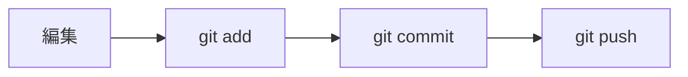

# Git コマンド早見表（中途参加・新入向け）

> 最終更新: {{LAST_UPDATED}}

途中参加したメンバーが、**迷わず日常の Git 操作をできる**ことを目的にしたナレッジです。
全部覚える必要はありません。やりたいことから該当セクションを開いてコピーしてください。

**実行場所**: リポジトリのルート（`.git` フォルダがあるディレクトリ）で実行します。

```powershell
# リポジトリ内か確認（True なら OK）
Test-Path .git
```

コマンド例は **PowerShell** を主とし、違いがある場合のみ **bash** を併記します。

---

## 1. 用語（30 秒で把握）

| 用語 | 意味 |
|---|---|
| ワーキングツリー | 今編集しているファイルの状態 |
| ステージ（index） | 次のコミットに含める変更の候補 |
| コミット | 変更のスナップショット（ローカル履歴） |
| ブランチ | 作業ライン。`main` が本流のことが多い |
| リモート | GitHub 等の共有先（通常 `origin`） |
| push / pull | ローカル ↔ リモートの送受信 |

---

## 2. 初日：クローンと自分の設定

### リポジトリを取得する

```powershell
# HTTPS の例（URL はプロジェクトのものに置き換え）
git clone https://github.com/ORG/REPO.git
Set-Location REPO
```

```bash
git clone https://github.com/ORG/REPO.git
cd REPO
```

### 名前・メール（初回のみ）

コミット履歴に載る情報です。会社アカウントのメールを使います。

```powershell
git config --global user.name "山田 太郎"
git config --global user.email "taro.yamada@example.com"
```

確認:

```powershell
git config --global user.name
git config --global user.email
```

### 現在の状態をざっと見る

```powershell
git status
git branch
git log --oneline -10
```

---

## 3. 毎日の基本フロー（いちばんよく使う）



| やりたいこと | コマンド |
|---|---|
| 変更一覧を見る | `git status` |
| 差分を見る | `git diff` |
| ステージ済みの差分 | `git diff --staged` |
| 全部ステージする | `git add .` |
| ファイル単位でステージ | `git add path/to/file.py` |
| コミットする | `git commit -m "変更内容を一文で"` |
| リモートへ送る | `git push` |

### コミットメッセージの例

```
feat: 在庫一覧にフィルタを追加
fix: ログイン失敗時のエラーメッセージを修正
docs: Git 早見表を追加
```

チームで Conventional Commits を使っている場合は、その形式に合わせてください。

---

## 4. ファイル操作（追加・移動・削除・リネーム）

エクスプローラーや `mv` / `rm` だけでも動きますが、**Git で操作すると「移動・削除」が履歴に正しく残り**、`git status` も分かりやすくなります。可能なら `git mv` / `git rm` を使うのがおすすめです。

### 一覧：やりたいこと → コマンド

| やりたいこと | おすすめ | エクスプローラーでやったあと |
|---|---|---|
| 新規ファイルを Git 管理に載せる | `git add path/to/new.py` | 同左（`git add .` でも可） |
| リネーム・移動（履歴をつなぐ） | `git mv old.py new.py` | `git add -A` または旧を `git rm` + 新を `git add` |
| ファイルをリポジトリから削除 | `git rm path/to/file.py` | 手で削除後 `git add -u` |
| 削除だけステージ（ファイルは残す） | `git rm --cached secret.env` | — |
| 変更・削除をまとめてステージ | `git add -u` | 手動変更後に実行 |
| 新規・変更・削除をすべてステージ | `git add -A` | 手動変更後に実行 |
| 追跡中のファイル一覧 | `git ls-files` | — |
| リネームを含む差分の見方 | `git status` / `git diff -M` | — |

### 新規ファイルを追加する

```powershell
# 単体
git add src/your_package/new_module.py

# フォルダごと
git add src/your_package/services/

# リポジトリ内の変更をすべて（新規・変更・削除）
git add -A
```

`-A` は **新規・変更・削除** をまとめてステージします。意図しないファイルが混ざらないよう、慣れるまでは `git status` を先に確認してください。

### リネーム・移動（`git mv`）

履歴を引き継いだ「移動」として記録されます。PR の差分も読みやすくなります。

```powershell
# リネーム（同じフォルダ内）
git mv src/old_name.py src/new_name.py

# 別フォルダへ移動
git mv src/utils/helpers.py src/services/helpers.py

# ディレクトリごと移動
git mv doc/draft doc/archive/draft
```

```bash
git mv src/old_name.py src/new_name.py
```

コミット例:

```powershell
git commit -m "refactor: helpers を services 配下へ移動"
```

### エクスプローラーで移動・リネームしたあと

すでに手で動かしてしまった場合は、Git に変更を認識させます。

```powershell
git status          # renamed / deleted / untracked を確認
git add -A          # 移動・削除・追加をまとめてステージ
git status          # 意図どおりか再確認
git commit -m "refactor: モジュール構成を整理"
```

`renamed:` と表示されれば、移動として認識されています。

### ファイル・フォルダを削除する

```powershell
# ディスク上からも削除し、次のコミットで Git 管理から外す
git rm src/obsolete.py

# フォルダ（中身ごと）
git rm -r tests/fixtures/old_dataset/

# リポジトリからだけ外す（ローカルファイルは残す）※ .env 誤追加の救済など
git rm --cached config/.env
```

エクスプローラーで削除した場合:

```powershell
git add -u
# または
git add path/to/deleted_file.py
```

### 追跡していないファイル（untracked）を片付ける

| 状況 | 操作 |
|---|---|
| 作ったがコミット不要（ゴミ） | ファイルを削除するか `Remove-Item` |
| 誤って作ったが Git に載せたくない | 削除 + `.gitignore` に追記 |
| 大量の未追跡を一掃（**要注意**） | `git clean -fd`（下記参照） |

```powershell
# 何が消えるか確認（ドライラン）
git clean -fdn

# 未追跡のファイル・空ディレクトリを削除（復元不可）
git clean -fd
```

`git clean` は **Git に一度も載っていないファイル** が対象です。実行前に必ず `-n` で確認してください。

### Windows で大文字・小文字だけ変えたいとき

Windows のファイルシステムは大文字小文字を区別しないため、単なるリネームが効かないことがあります。2 段階で `git mv` します。

```powershell
git mv config.py config.py.bak
git mv config.py.bak Config.py
git commit -m "fix: Config.py にリネーム（ケース修正）"
```

### 特定コミット時点のファイルを取り出す（復元）

```powershell
# 1 コミット前の内容で上書き（未コミットの編集は失われる）
git restore --source=HEAD~1 path/to/file.py

# 別ブランチのファイルをこのブランチに持ってくる
git restore --source=main path/to/file.py
```

### ディレクトリ構成のリファクタで便利な流れ

```powershell
git switch -c refactor/reorganize-src
git mv src/old_pkg/module.py src/new_pkg/module.py
# import パスなどをエディタで修正
git add -u
git status
git diff --staged --stat
git commit -m "refactor: new_pkg へモジュールを移動"
```

### ファイル操作の注意

- **`git add .` だけ**だと、カレントより下の新規・変更は拾えますが、**削除だけ**は拾えないことがあります。削除後は `git add -u` か `git add -A` を使います。
- **`data/`・`logs/`・`.env`** は通常 `.gitignore` 済みです。`git add -A` で誤って載せないよう、`git status` で確認してください。
- 巨大ファイルや生成物は Git に入れず、必要なら [Git LFS](https://git-lfs.com/) をチームで検討します。

---

## 5. ブランチで作業する（推奨）

`main` に直接 push せず、**機能ごとにブランチ**を切る運用が一般的です。

| やりたいこと | コマンド |
|---|---|
| ブランチ一覧 | `git branch` |
| 新しいブランチを作って移動 | `git switch -c feature/my-task` |
| ブランチを切り替え | `git switch main` |
| リモートの最新を取り込んでからブランチ作成 | 下記「最新の main から始める」参照 |
| 初回 push（上流を設定） | `git push -u origin feature/my-task` |
| 2 回目以降の push | `git push` |

### 最新の `main` から作業を始める

```powershell
git switch main
git pull origin main
git switch -c feature/my-task
```

```bash
git switch main
git pull origin main
git switch -c feature/my-task
```

> 古い Git では `git switch` の代わりに `git checkout -b feature/my-task` を使います。

---

## 6. リモートと同期（pull / fetch）

| やりたいこと | コマンド |
|---|---|
| リモートの変更を取得してマージ | `git pull` |
| 取得だけ（マージしない） | `git fetch` |
| リモート一覧 | `git remote -v` |
| 今のブランチの追跡先 | `git branch -vv` |

### 作業前にリモートの最新を取り込む

```powershell
git fetch origin
git pull
```

---

## 7. 変更を取り消す・直す

| 状況 | コマンド | 注意 |
|---|---|---|
| ファイルの変更を捨てる（未ステージ） | `git restore path/to/file` | **ローカルの編集が消えます** |
| ステージを取り消す | `git restore --staged path/to/file` | ファイル内容は残る |
| 直前のコミットをやり直す（未 push） | `git commit --amend` | 履歴を書き換える |
| 直前のコミットを取り消す（変更は残す） | `git reset --soft HEAD~1` | 未 push 向け |

**push 済みのコミット**を取り消す場合は、チームに相談してから `git revert` を使います（履歴を残して打ち消す）。

```powershell
git revert HEAD
```

---

## 8. コンフリクト（競合）が出たとき

`git pull` や `git merge` のあとに CONFLICT と表示されたら:

1. `git status` で競合ファイルを確認
2. エディタで `<<<<<<<` 〜 `>>>>>>>` を手で解消
3. 解消したファイルを `git add`
4. `git commit`（マージコミット）または `git merge --continue`

取りやめ:

```powershell
git merge --abort
```

---

## 9. 履歴・差分を調べる

| やりたいこと | コマンド |
|---|---|
| 直近のコミット（1 行） | `git log --oneline -20` |
| 特定ファイルの履歴 | `git log --oneline -- path/to/file` |
| 誰がいつ変更したか（行単位） | `git blame path/to/file` |
| 2 コミット間の差分 | `git diff abc1234..def5678` |
| ステージ前の変更をファイルごとに見る | `git diff path/to/file` |

---

## 10. 一時退避（stash）

作業の途中でブランチを切り替えたいとき:

| やりたいこと | コマンド |
|---|---|
| 変更を棚に上げる | `git stash push -m "WIP: 説明"` |
| 一覧 | `git stash list` |
| 戻す | `git stash pop` |
| 戻さず一覧だけ消す | `git stash drop` |

---

## 11. GitHub と PR（`gh` CLI）

[GitHub CLI](https://cli.github.com/) が入っていると、ブラウザを開かずに PR まで進められます。

| やりたいこと | コマンド |
|---|---|
| ログイン | `gh auth login` |
| PR 作成 | `gh pr create` |
| PR 一覧 | `gh pr list` |
| PR の差分確認 | `gh pr diff 123` |
| CI 状況 | `gh pr checks` |

push 後の例:

```powershell
git push -u origin feature/my-task
gh pr create --title "機能名" --body "## 概要`n- 変更点"
```

---

## 12. よくあるトラブル

### `Your branch is behind 'origin/main'`

リモートより古い状態です。作業ブランチで:

```powershell
git pull --rebase origin main
```

チームのルールが `merge` の場合は `git pull` のみ。不明なら先輩に確認してください。

### `Please commit your changes or stash them`

未コミットの変更があるため切り替えできません。

- コミットする、または
- `git stash` してから `git switch`

### `Permission denied` / 認証エラー

- HTTPS: Personal Access Token（PAT）が必要なことがあります
- SSH: `ssh -T git@github.com` で鍵登録を確認

### 間違えて `main` にコミットしてしまった

まだ push していなければ:

```powershell
git switch -c feature/fix-branch
git switch main
git reset --hard origin/main
```

`reset --hard` は**ローカルの変更を消します**。push 済みの場合は必ずチームに相談してください。

---

## 13. 避けた方がよい操作（初心者向け注意）

| コマンド | 理由 |
|---|---|
| `git push --force`（特に `main`） | 他人の履歴を壊す可能性 |
| `git reset --hard` | 未保存の変更が消える |
| `.env` や秘密鍵のコミット | リポジトリに載せない（`.gitignore` 確認） |
| 巨大ファイルの無意な `git add` | `data/` や `logs/` は通常除外済み |

困ったときは **実行前に `git status` と `git log --oneline -5`** を先輩やチャットに貼って相談すると安全です。

---

## 14. クイックリファレンス（コピペ用）

```powershell
# --- 朝イチ ---
git switch main
git pull

# --- 作業開始 ---
git switch -c feature/task-name

# --- 作業中 ---
git status
git add .
git commit -m "feat: 〇〇を追加"

# --- ファイル操作 ---
git mv src/old.py src/new.py
git rm path/to/obsolete.py
git add -A
git status

# --- 共有 ---
git push -u origin feature/task-name
gh pr create

# --- 状態確認 ---
git log --oneline -10
git diff
```

---

## 関連ドキュメント

| ドキュメント | 内容 |
|---|---|
| [../getting-started/入門ガイド.md](../getting-started/入門ガイド.md) | フォルダ構成・読む順番 |
| [../setup/uv.md](../setup/uv.md) | Python / uv 環境構築 |
| [../README.md](../README.md) | reference 目次 |
| [実装規約.md](../ai_guidelines/実装規約.md) | PR 粒度・命名規約 |
