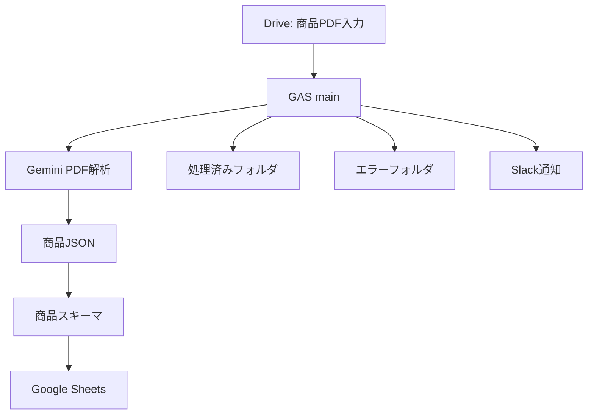

# 商品PDF抽出 引継ぎ資料

最終更新: 2026年6月27日

> 目的: 既存の名刺PDF→Google Sheets RPAを参考に、商品PDFから商品名・消費期限・栄養成分などを抽出してスプレッドシートへ転記する新プログラムを作るための引継ぎ資料。
> 既存プロジェクトの正本は `doc/specs/02_要件定義.md` / `doc/specs/03_システム設計.md` / `gas/src/schema.js`。本資料は商品PDF版へ派生する際の要件・設計たたき台。

---

## 1. 作りたいもの

Google ドライブ内の指定フォルダに置いた商品PDFを、GAS + Gemini API で読み取り、商品情報を構造化 JSON に変換して Google スプレッドシートへ追記する。

想定する入力は、商品ラベル、商品仕様書、食品表示、栄養成分表示を含むPDF。まずは **1 PDF = 1 商品 = 1 シート行** を初期前提にする。1 PDFに複数商品が載るケースは、実サンプル確認後に別設計とする。



---

## 2. 既存プロジェクトから流用するもの

| 領域 | 既存ファイル | 商品PDF版での扱い |
|---|---|---|
| 処理制御 | `gas/src/main.js` | PDF列挙、1件処理、バッチ継続、エラー分類を流用 |
| Drive操作 | `gas/src/drive.js` | 入力・処理済み・エラーフォルダの3分離を流用 |
| Gemini通信 | `gas/src/gemini.js` | PDFをinlineDataで渡す方式、JSON応答指定、低temperature、429/500系リトライ、401即停止を流用 |
| 列定義 | `gas/src/schema.js` | 商品向け列へ差し替え。GeminiキーとSheets列順の正本にする |
| Sheets追記 | `gas/src/spreadsheet.js` | schema列順で行を組み立てる方式を流用。重複チェックは商品キー向けに再設計 |
| セットアップ | `gas/src/setupSpreadsheet.js` | 商品DBシートの作成・ヘッダー再適用に流用 |
| UI | `gas/src/ui.js` / `gas/ControlPanel.html` | メニュー名、説明文、ボタン文言を商品PDF向けに変更 |
| 通知 | `gas/src/notification.js` | Slack通知の仕組みを流用。通知タイトル・本文を商品PDF向けに変更 |

既存コードの重要な制約として、シート書き込みは `schema.js` の列順に依存する。スプレッドシートUIだけで列を移動するとヘッダーとデータがずれるため、商品版でも列変更は `schema.js` 起点で行う。

---

## 3. 商品PDF版の要件たたき台

### Must

| 要件 | 内容 |
|---|---|
| PDF自動検知 | 指定Driveフォルダ内の未処理PDFを列挙する |
| 商品情報抽出 | Geminiで商品PDFから商品情報JSONを抽出する |
| Sheets追記 | 抽出JSONを商品DBシートへ1行追加する |
| 処理済み移動 | 正常処理後、PDFを処理済みフォルダへ移動する |
| エラー隔離 | 解析失敗PDFをエラーフォルダへ移動し、他ファイルの処理を継続する |
| 秘密情報管理 | Gemini APIキー、Slack Webhook、DriveフォルダIDをコードやログに出さない |

### Should

| 要件 | 内容 |
|---|---|
| 重複チェック | JANコード、商品コード、または商品名+メーカー+期限の組み合わせで既存行を検知する |
| 期限表記の正規化 | `YYYY-MM-DD` を推奨形式にする。読み取れない場合は原文をメモに残す |
| 栄養成分の単位保持 | kcal、g、mgなどの単位を列名または値に残し、転記後に意味が失われないようにする |

### Could

| 要件 | 内容 |
|---|---|
| 複数商品対応 | 1 PDFから複数商品を抽出し、複数行へ展開する |
| 栄養成分の別シート化 | 多数の栄養項目を商品基本情報と分けて保持する |
| 信頼度メモ | 読み取り曖昧箇所、表記ゆれ、欠損を `confidence_notes` へ記録する |

### Wont（初期実装では対象外）

| 項目 | 理由 |
|---|---|
| 在庫管理・販売管理 | PDF抽出とSheets転記の範囲を超える |
| 人手確認ワークフロー | 初期版ではSheets上で確認する |
| OCR結果の画像補正 | GeminiにPDFを直接渡す既存方式を先に検証する |

---

## 4. 初期スキーマ案

初期実装では、Sheetsで検索・フィルタしやすい主要項目をフラット列にする。栄養成分は日本の食品表示でよく使う主要項目を列化し、それ以外は `nutrition_notes` に寄せる。

| 列ヘッダー | 内部キー | Gemini | 備考 |
|---|---|:---:|---|
| 処理日時 | `processed_at` | — | GAS付与 |
| 元ファイル | `source_file` | — | GAS付与 |
| 商品名 | `product_name` | ○ | 必須候補 |
| メーカー | `maker` | ○ | 販売者・製造者を含む |
| ブランド | `brand` | ○ | 読み取れる場合のみ |
| JANコード | `jan_code` | ○ | 重複キー候補 |
| 商品コード | `product_code` | ○ | JANがない場合の重複キー候補 |
| 期限種別 | `expiration_type` | ○ | 消費期限 / 賞味期限 / 不明 |
| 期限日 | `expiration_date` | ○ | 可能なら `YYYY-MM-DD` |
| 内容量 | `net_content` | ○ | 例: 100g、500ml |
| 原材料 | `ingredients` | ○ | 原文ベース |
| アレルゲン | `allergens` | ○ | 例: 小麦、卵、乳 |
| 保存方法 | `storage_method` | ○ | 原文ベース |
| 原産国 | `country_of_origin` | ○ | 読み取れる場合のみ |
| 栄養成分の基準量 | `serving_size` | ○ | 例: 100gあたり、1食あたり |
| エネルギー kcal | `energy_kcal` | ○ | 数値または原文 |
| たんぱく質 g | `protein_g` | ○ | 数値または原文 |
| 脂質 g | `fat_g` | ○ | 数値または原文 |
| 炭水化物 g | `carbohydrate_g` | ○ | 数値または原文 |
| 食塩相当量 g | `salt_equivalent_g` | ○ | 数値または原文 |
| 栄養成分メモ | `nutrition_notes` | ○ | その他成分、単位不明、表の注記 |
| 読み取りメモ | `confidence_notes` | ○ | 曖昧・欠損・推定の記録 |
| 備考 | `notes` | ○ | その他 |

Gemini JSON例:

```json
{
  "product_name": "",
  "maker": "",
  "brand": "",
  "jan_code": "",
  "product_code": "",
  "expiration_type": "",
  "expiration_date": "",
  "net_content": "",
  "ingredients": "",
  "allergens": "",
  "storage_method": "",
  "country_of_origin": "",
  "serving_size": "",
  "energy_kcal": "",
  "protein_g": "",
  "fat_g": "",
  "carbohydrate_g": "",
  "salt_equivalent_g": "",
  "nutrition_notes": "",
  "confidence_notes": "",
  "notes": ""
}
```

---

## 5. 重複チェック方針

初期推奨は、次の優先順位で重複キーを決める。

1. `jan_code` が読める商品は JANコードで判定する
2. JANコードがない場合は `product_code` で判定する
3. どちらもない場合は `product_name + maker + expiration_date` の組み合わせを候補にする

既存実装は `email` 前提の `normalizeEmailForDuplicateCheck_()` と `findExistingRowByNormalizedEmail_()` に寄っている。商品版では、キー種別ごとに正規化できる `normalizeDuplicateValue_()` または商品専用の複合キー生成関数へ置き換える。

---

## 6. Geminiプロンプト方針

`gas/src/gemini.js` のリクエスト方式は流用し、`buildGeminiPrompt_()` の文言を商品PDF向けに差し替える。

プロンプトに含める指示:

- 商品ラベルまたは商品仕様書から読み取れる情報のみ埋める
- 読み取れない項目は空文字 `""` にする
- 期限は可能なら `YYYY-MM-DD`、判断できない場合は原文を `confidence_notes` に残す
- 栄養成分は基準量と単位を失わない
- 説明文、Markdown、コードブロックは出力せずJSONオブジェクトのみ返す
- 複数商品が見える場合、初期版では主対象の商品1件のみを返し、`confidence_notes` に複数商品の可能性を書く

---

## 7. 検証観点

| 観点 | 確認内容 |
|---|---|
| 正常系 | 1 PDF 1商品で、商品名・期限・栄養成分がシートの想定列へ入る |
| 欠損 | 期限やJANがないPDFで空文字になり、処理が失敗しない |
| 期限表記ゆれ | `2026.06.27`、`26年6月27日`、`枠外記載` などを確認する |
| 栄養成分表 | `100gあたり`、`1包装あたり`、単位違い、成分追加を確認する |
| 複数ページ | PDFの後続ページに表示情報がある場合に拾えるか確認する |
| 複数商品 | 初期版の非対応範囲として、主対象1件のみになるかメモに残るか確認する |
| 解析失敗 | 破損PDF、画像不鮮明PDFをエラーフォルダへ隔離しSlack通知する |
| 重複 | 同じJANまたは商品コードで2回投入した場合の挙動を確認する |

---

## 8. 未確定事項

| 項目 | 初期案 | 決めるタイミング |
|---|---|---|
| 1 PDFに複数商品がある場合 | 初期版は1商品のみ | 商品PDFサンプル確認後 |
| 栄養成分の保持形式 | 主要成分をフラット列、その他はメモ | 初期実装前 |
| 重複キー | JAN優先、次に商品コード、最後に複合キー | 実サンプル確認後 |
| 期限の扱い | 消費期限/賞味期限を `expiration_type` で分離 | 実サンプル確認後 |
| シート名 | `商品DB` 候補 | 実装前 |
| 通知先 | 既存Slack Webhook流用または新規 | 運用前 |

---

## 9. 実装へ進むときのdoc同期

商品PDF版を実装した場合は、次を更新する。

- `doc/specs/02_要件定義.md`: 商品PDF版のFR/NFR、MoSCoW、入力/出力を反映
- `doc/specs/03_システム設計.md`: 商品DBの列定義、Gemini JSON例、重複チェック、Workspace構成を反映
- `doc/specs/04_機能一覧.md`: 新しいFR/NFRコードまたは既存コードの実装状況を反映
- `doc/specs/07_CHANGELOG.md`: `[Unreleased]` にFR/NFRコード付きで1行追記
- `doc/records/agent_sessions/`: チャットで実装した場合はセッション記録を追加

秘密情報、実APIキー、Webhook URL、実フォルダID、個人情報を資料に記載しない。
